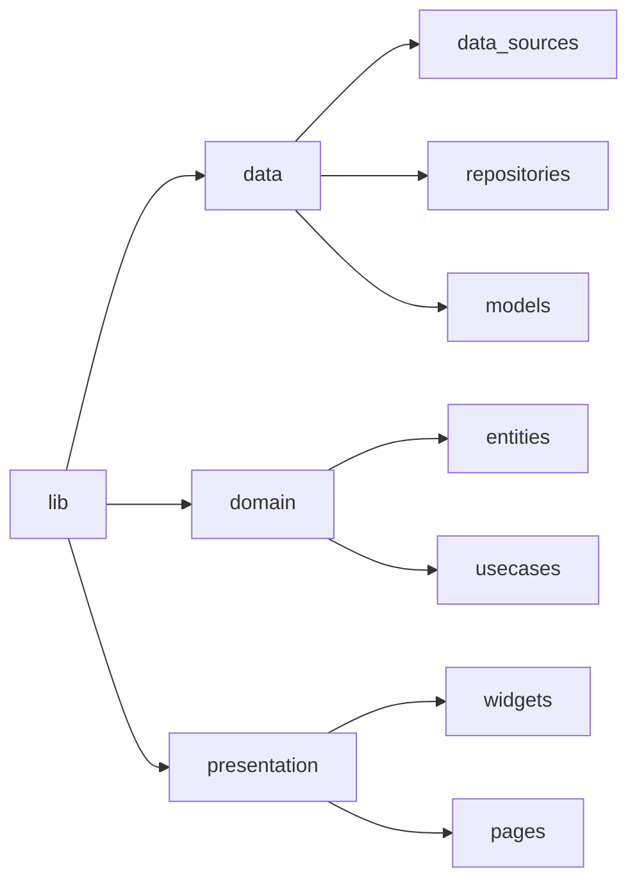
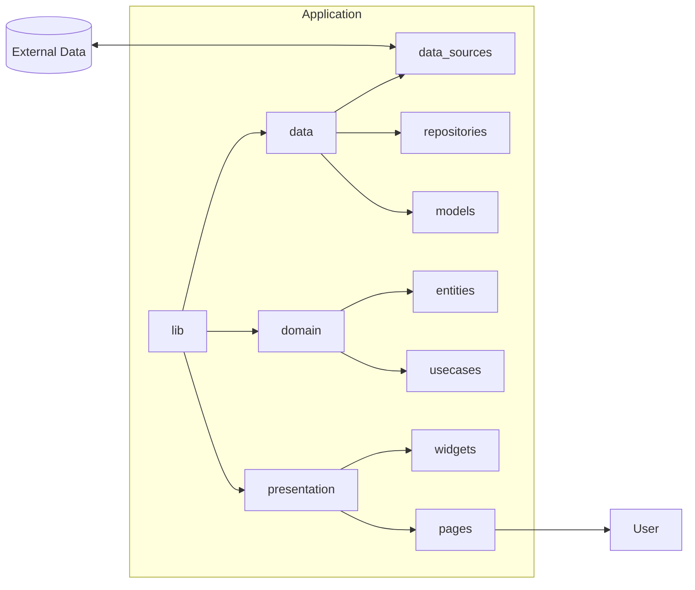

import { Zapprun } from '@site/src/components/Zapprun/Zapprun';

:::warning

I am writing this as a learning aid for myself for me to refer back to. While I am confident in what I write here, like anyone else I can be wrong. Please verify any information before making important decisions with it!

:::

## Introduction

### The What and Why of Clean Architecture
**Clean architecture is a software design system** of separating concerns. Simply put, **code for different stuff goes in different places**, everything is modular.

One of the hardest things to learn as a new developer is how to structure your project. The project structure is not only how files and folders are organized, it is the actual anatomy of how your application lives and breathes. A poorly designed app might work on the surface but will be buggier, harder to test, and harder to maintain. 

Like most skills in coding, the only way to truly understand it is by trying it yourself. On this page, I will go through the process of adding a feature to an app in Flutter using clean architecture. A must-read article that goes over more theory from [Free Code Camp can be found here](https://www.freecodecamp.org/news/a-quick-introduction-to-clean-architecture-990c014448d2/).

### Is Clean Architecture Really Needed?

No. If you're making software for yourself, then go crazy and do what you want! 

But if you are making software for others, WITH others or that needs to be scaleable and maintainable, then you have a responsibility to write clean reliable code. 
Anything over a small application will need to follow some type of convention, like clean architecture.

## Defining "concerns" in Separation of Concerns 

### Presentation, Domain, & Data Layers
While sometimes this is broken down more, this is the most common and simple layout that I see.

These are often called layers, concerns, levels, and probably many more. In practice, these are just folders where you organize the code in your project. I most often say layers.

#### Data:

The data layer handles all data going in and out of your application. I tend to think of it as immigration at the airport, it controls the access in and out of your app. Any data going in or out of your app gets sent through this layer.

#### Domain:

The domain layer is usually the hardest one to grasp. This is where you process data in your application. This is very often called business logic. I think that is a pretty bad name for it. Business logic is any logic your app uses, it does not have to be "business" specific. 

If you want a feature where every time says a word like bee or book it gets replaced with an emoji, you would put that logic in the 

  
Emoji Business Logic Example

  Here is an example of what some business logic looks like. I hate that name, but it's what everyone says so I do too.

  **Feature:** Replace all instances of "book" or "bee" should be replaced with emojis. Since this doesn't need outside data, we only need the domain layer to implement this feature.

  :::note

  We haven't gone over the subfolders within the domain, data, and presentation folders yet. I will quickly break it down here but will go into it further down the page.

  Above the code examples, the file structure is shown.

  :::

  First, we create a repository file called `emoji_replacement_usecase.dart` in the `domain/usecases` folder. Then we create a widget in the `presentation/widgets` folder called `example_widget.dart`. 

  Within the `emoji_replacement_usecase.dart` file we use our logic to change data. In the `example_widget.dart` we call the logic.

  In the editor below, go through the `emoji_replacement_usecase.dart` and `example_widget.dart` file to see how everything works together. Don't be afraid to change stuff around and rerun to see what changes. This is a fully functional sandbox. To get more space you can press the "Open in Zapp!" button
  
  <Zapprun 
    editorPreviewSplitPercent={75}
    heightStyle='50vh'
    widthStyle='100%'
    zaprunEditorLink='https://zapp.run/edit/flutter-za6m06b1b6n0?entry=lib/main.dart&file=lib/domain/usecases/emoji_replacement_usecase.dart'
  />

  The logic in `domain/usecases/emoji_replacement_usecase.dart` is business logic. It is a misleading name but it's what I hear everyone call it. 
  I propose we rename it, how about app logic or domain logic? Either way, this is how you handle the logic needed in your application. 
  
  Of course, this is a very simple example, but this scales very well. Each piece of logic you need gets its own usecase file.

#### Presentation:

The presentation layer is where all of the UI gets organized. 

Both widgets and pages get organized in the presentation layer.

## Different File Layouts

There is more that goes into each layer than just the headline, they each have about three sub-layers.

Before we get into that I want to look at the two main options for file structure. There are a few ways to organize the file structure in a project with clean architecture. The two I see come up the most is _**explain here the two ways where the one is broken down by feature and the otherone where everything is at the root**_

### file layout option 1
explanation 1

### file layout option 2
explanation 2

mermaid chart 2

## Practical Example

### Make a plan
I find the most important part of coding is thinking about it beforehand. If I don't think through it first I tend to write the code a few times before getting something I'm happy with.

_**do a mermaid chart or something explaining how all of this will work**_

### Set up firebase on your own

### set up `main.dart` file

{/* <!-- ### What I'll Be Making */}
{/* On this page, I will make a Flutter app that has a theme syncing feature. When the app opens it will check a Firebase FireStore database for theme information and then will build the UI based on that information. --> */}