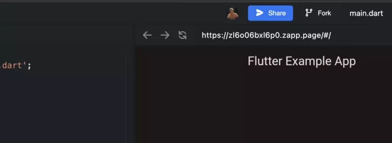
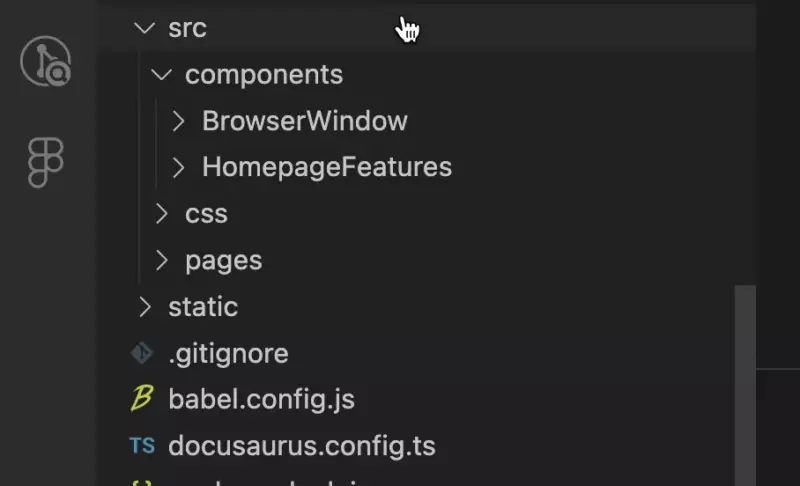

import Tabs from '@theme/Tabs';
import TabItem from '@theme/TabItem';
import { Zapprun } from '@site/src/components/Zapprun/Zapprun';

[Zapp.run](https://zapp.run) is a sandbox that can run dart and flutter on the browser. It can compile anything compatible with Flutter Web, including [pub.dev](https://pub.dev) packages!

Zapp.run even lets you preview the build by scanning a qr code, great for quick testing!

:::warning

The sandbox is compiled and run on your computer, so the specs of your computer make a significant difference in the speed.

If it is running slow, it is because of your system.

Read more on [Zapp.run's limitations page](https://docs.zapp.run/running-and-saving#limiations) for more information.

:::

## Example of Zapp.Run Sandbox
Here is a simple example that is similar to Flutter's default hello world app.

    <Zapprun
          heightStyle='60vh'
          editorPreviewSplitPercent={50}
          zaprunEditorLink='https://zapp.run/edit/flutter-zl6o06bxl6p0?entry=lib/main.dart&file=lib/main.dart'
        />


## How to Use 

:::warning[This needs to be set up]

This is a completely custom component that I made. This doesn't come with Docusaurus.

If you haven't done the initial setup yet, [go here](#set-up) to complete that first.

:::

### Start Your Zapp.run Sandbox

You can start a new sandbox by going to [zapp.run/new](https://zapp.run/new) to create a new file from their templates. When you start from a template or someone else's sandbox, press the **fork** in the top right to make your own copy, which can be shared.

You can also start a sandbox from a GitHub repo, to do that, simply go to the link `https://zapp.run/github/{{UserNameOrOrg}}/{{RepositoryName}}`. Of course, switch out the area I surrounded by `{{}}`. 

An example of a GitHub import link is [https://zapp.run/github/roaa94/flutter_3d_calculator](https://zapp.run/github/roaa94/flutter_3d_calculator).

### Get Your Sandbox link

Ensure your editor has the files and tabs open that you want to have in your embedded sandbox then ensure it is saved.

Press the **share** button in the top right corner. Press "Copy project link"



:::danger[This is the only way to get the link]

It is very important to copy this link and not the embedding link or the link shown in your browser. They might not always work with this component.

:::

Insert this link in the `zaprunEditorLink` parameter when using the component.

### MDX File & Import
This requires an MDX file. Simply make the file ending `.mdx`. This will not work in a regular markdown file.

Import the component at the top of the page like below. Ensure the import statement is below the front matter.

```dart title="example-doc.mdx"
import { Zapprun } from '@site/src/components/Zapprun/Zapprun';
```

Use the `<Zapprun />` to use the component.
If the `zaprunEditorLink` is not defined, it will default to the link shown below. (this can be changed in the code in the [setup section](#set-up))

```dart title="example-doc.mdx"
import { Zapprun } from '@site/src/components/Zapprun/Zapprun';

<Zapprun
    zaprunEditorLink='https://zapp.run/edit/flutter-zl6o06bxl6p0?entry=lib/main.dart&file=lib/main.dart'
/>
```

### Available Parameters
- `zaprunEditorLink` is where you put the link to the editor
- `editorPreviewSplitPercent` is where you put the Percentage of default split between the editor and preview
- `heightStyle` is the high styling
- `widthStyle` is the width style

Typically, I will only define `zaprunEditorLink` and will leave all of the other\'s values default (by not writing defining them at all). I will change the `editorPreviewSplitPercent` if the code or preview needs extra space.

`heightStyle` takes css styles, so any pixel or Percentage should work, but I prefer to use viewport height, written as `vh`. The default is `90vh`, which will usually fit within the visible space of the site.

```dart title="example-doc.mdx"
import { Zapprun } from '@site/src/components/Zapprun/Zapprun';

<Zapprun
    zaprunEditorLink='https://zapp.run/edit/flutter-zl6o06bxl6p0?entry=lib/main.dart&file=lib/main.dart'
    editorPreviewSplitPercent={50}
    heightStyle='35vh'
    widthStyle='100%'
/>
```

        <Zapprun
              zaprunEditorLink='https://zapp.run/edit/flutter-zl6o06bxl6p0?entry=lib/main.dart&file=lib/main.dart'
              heightStyle='35vh'
              widthStyle='100%'
              editorPreviewSplitPercent={50}
            />


## Set Up 

:::info[Extra configuration might be required for JavaScript]

I made this component for Docusaurus. Docusaurus uses React, and I configured my project to use TypeScript, so my files will have `.tsx` endings. 

If you used JavaScript to set up Docusaurus, you might need to rewrite parts of this code to make it work with vanilla JS.

:::

In your Docusaurus project, navigate to `src/components` and create a folder named `Zapprun` and a file within that folder named `Zapprun.tsx`.

:::tip

In VS Code you can make a file and folder in one step. In the `components` folder click "New File" and enter into the box `Zapprun/Zapprun.tsx`

        <details>
              <summary>Tip Video</summary>

    

        </details>

:::

Copy and paste this code into `Zapprun.tsx`. (there is a copy button at the top right of the code block)

```dart showLineNumbers title="Zapprun.tsx"
import { useColorMode } from '@docusaurus/theme-common';

// NOTE:
// If you change the light/dark theme, the sandbox will refresh and any edits will be lost
// If theme control is less important than this limitation, then:
// • remove the findThemeLightnessMode() function declaration 
// • to have it default to the system theme, delete the entire line 34
// • to hardcode a theme, on line 34 replace findThemeLightnessMode() with "theme=light"

function findThemeLightnessMode() {
  const { colorMode, setColorMode } = useColorMode();
  return colorMode;
}

// NOTE:
// defaults for the component can be edited below
// where the parameters = a value, change the value to change the default. 
// the default values can still be changed on use

export function Zapprun({
  zaprunEditorLink = "https://zapp.run/edit/flutter-zwa206oewa30?entry=lib/main.dart&file=lib/main.dart",
  editorPreviewSplitPercent = 60, // number between 0-100. Percentage split
  heightStyle = "90vh", //css height style
  widthStyle = "100%", //css width style
}): JSX.Element {

  const splitLinkAtParams = zaprunEditorLink.split("?"); //this allows us to insert the theme param first, as it doesnt work at the end of the url

  return (
    <iframe
      src={
        splitLinkAtParams[0] +
        "?theme=" +
        findThemeLightnessMode() +
        "&" +
        "split=" + editorPreviewSplitPercent +
        "&" +
        splitLinkAtParams[1]
      }
      style={{
        "height": heightStyle,
        "width": widthStyle,
      }}
    />
  );
}
```

Now you will be able to use the `<Zapprun />` component within `.mdx` files. 

Go [here](#how-to-use) to see how to use.


