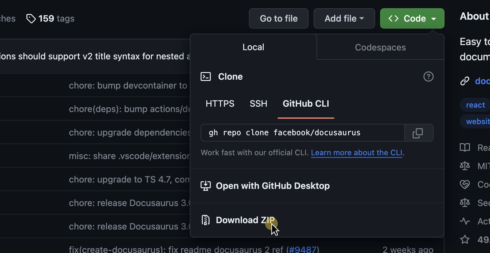
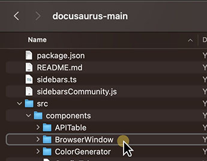
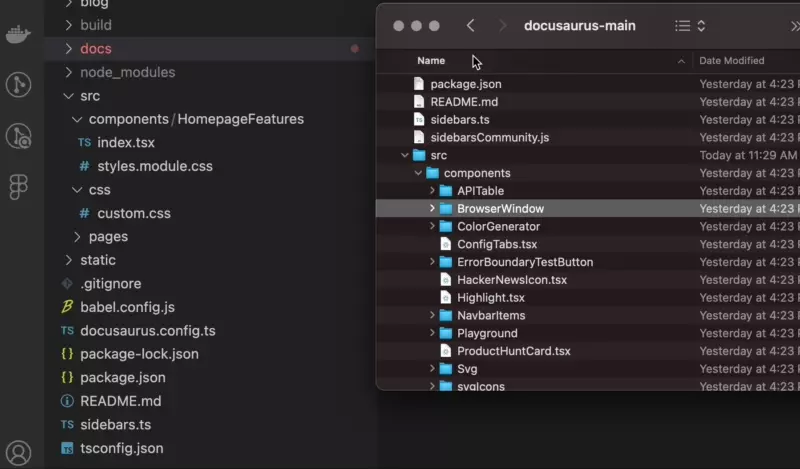

import BrowserWindow from '@site/src/components/BrowserWindow';

## Example:
<BrowserWindow url="https://CustomUrl.com">

    Put anything you want in here!

</BrowserWindow>

```javascript
import BrowserWindow from '@site/src/components/BrowserWindow';

<BrowserWindow url="https://CustomUrl.com">

    Put anything you want in here!

</BrowserWindow>
```


## Installing the Browser Window

While this component doesn't come with Docusarous, they have made it for their docs as an example of creating a custom component. 

Since the Docusarous site has an [MIT](https://github.com/facebook/docusaurus/blob/main/LICENSE) license, we can just copy the code and use it for ourselves!


### Step 1 - Download The Code
Go to Docusaurus's [GitHub page](https://github.com/facebook/docusaurus) and download the code as a zip file.

<BrowserWindow url="https://github.com/facebook/docusaurus">

</BrowserWindow>

### Step 2 - Find The component

Find the component named `BrowserWindow`

<details>
  <summary>File Structure</summary>

    ```mermaid
    graph LR;
    docusaurus-main-->website;
    website-->src;
    src-->components;
    components-->BrowserWindow;
```

</details>




### Step 3 - Add To Your Project
:::note

The default path of the component folder is `/src/components`

:::

Drag and drop the BrowserWindow folder into your Components folder in your project. You now have everything you need!




## Using the Browser Window

At the top of the page (but under any front matter) import the component.

```js
import BrowserWindow from '@site/src/components/BrowserWindow';
```

Then you can use the browser window in that file by using `<BrowserWindow>` tags. 

<BrowserWindow url="https://CustomUrl.com">

    Put anything you want in here!

</BrowserWindow>

```markdown
<BrowserWindow url="https://CustomUrl.com">

    Put anything you want in here!

</BrowserWindow>
```

:::tip[Change Your Default URL]

You can set the default URL in the `BrowserWindow/index.tsx` file.

Change the configuration as shown in the highlighted line below.

```typescript
export default function BrowserWindow({
  children,
  minHeight,
  // highlight-next-line
  url = 'http://AnythingYouWant.com', //change your url here
  style,
  bodyStyle,
}:
```

:::


