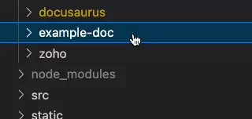

import Tabs from '@theme/Tabs';
import TabItem from '@theme/TabItem';
import TOCInline from '@theme/TOCInline';


    <details>
          <summary>Table of Contents</summary>
    <TOCInline toc={toc} />
        </details>
While creating a document is easy, there are a lot of small details to remember.
This doc will have all of the information needed to make a simple page.
    <Tabs queryString="asset-tab">
          <TabItem value="no-assets" label="Doc with no assets" default>
                              This is the simplest way to make a page. This only works for pages without specific assets such as images. This option can still be used with network images (images from 3rd party links).

          ## Create New MD File 

          create a new mark down file in the desired directory.

          

          Ensure the filename ends in `.md`.

          

          ---
                </TabItem>
  <TabItem value="doc-with-assets" label="Doc with assets">

                                                                                                                                    This method of creating a page allows you to have assets, such as images, share the same directory as the file. Where we would normally make a markdown file we will make a folder that holds the markdown file and assets.

## Create New Folder

Create a new folder with the name of the doc in the desired directory. 


Create a mark down file in the folder named the same as the folder thing


        <details>
                  <summary>Note: This is my preference and might not be best practice</summary>
:::info[Docusaurus does this different]

This will work regardless of the name of this file, as long as there is only one `.md` or `.mdx` file in the folder. Docusaurus themself names this file index in [their source code](https://github.com/facebook/docusaurus/tree/main/website/blog/2021-05-12-announcing-docusaurus-two-beta). I prefer to use the name of the document so that I don't have to specify the slug in the [front matter](#doc-metadata-front-matter) and so I can tell what the page is from the tab in VS code since I usually work on multiple pages at the same time.

:::

        </details>




Drag your files into the new folder


Use your assets in markdown like usual, ensuring to reference the asset file correctly


        <details>
                  <summary>Details about referencing files</summary>

  **What does the `.` mean?**

 The `.` in the path goes to the parent of the file/folder. You can go back to the parents parent by adding more `.`s. For example, if you have some docs that share assets you can have shared asset folders that each doc can reference. 

  Note the file structure below:


From each part in the file structure, `.` will go back one space to the left. You can think of each `.` going backwards (to the left), and each `/` going forward (to the right).
 `example-doc-3.md` can reference `img-3.jpeg` with `./img-3.jpeg`. 

Both `example-doc-1.md` and `example-doc-2.md` can access `img-1.jpeg` or `img-2.jpeg` with `../shared-imgs/img-1.jpeg` since it needs to go back in the directory twice it uses two `.`.

        </details>

---
      </TabItem>
          </Tabs>

## Doc Metadata

### What Each Piece of Metadata Does

- `id` is used in places like the `sidebars.ts` if manually configured and [other linking cases](/docs/docusaurus/show-folder-show-as-page#how)
  - If not used, the  value is automatically set the the file name with its path from the docs folder (without the file extension)
    - For example: `example-docs/example-doc` would be an autogenerated id.
- `sidebar_position` sets the position of the doc in the sidebar as long as you have `sidebars.ts` set to automatically create the sidebars
  - If two docs have the same sidebar position in the front matter, it goes by alphabetical order of the file name
- `sidebar_label` sets the sidebar label if not manually set in the `sidebars.ts` file
  - If unset, the sidebar label will use the title
- `title` Sets the title of the Page
  - The title is shown at the top of the doc
    - The title on the top of the page can be overridden by placing an H1 tag as the first piece of content, which will then replace the title text on the doc
  - The title is used as the label on the sidebar (unless manually configured in `sidebars.ts`)
  - If undefined, the file name will be set as the title
- `description` is the description of the page. It is used in the doccards and used as a variable
- `slug` is the URL of the page. By default, this will be the file id
- `tags` adds tags to the document.
  - Can search documents by tags
  - Can click on the tags to see other docs with the same tag
  - Shows up on the bottom of pages like this 


### Front Matter
We can add metadata to the doc using front matter. Front matter is YAML code inserted at the top of the document between two `---` like below. All front matter is optional and it can be left out completely.

:::warning[Front Matter Must Be The First Thing On The Page]

If the front matter is not the first thing in the markdown or MDX file then it will not be recognized. Front matter works with MDX files, but imports need to be done after the front matter.

:::

```
---
id: example-doc
sidebar_position: 1
sidebar_label: Example Sidebar Label
title: Example Document
description: This is an example description for an example doc.
slug: my-custom-url
tags:
  - Example Tag 1
  - Example Tag 2
---
```