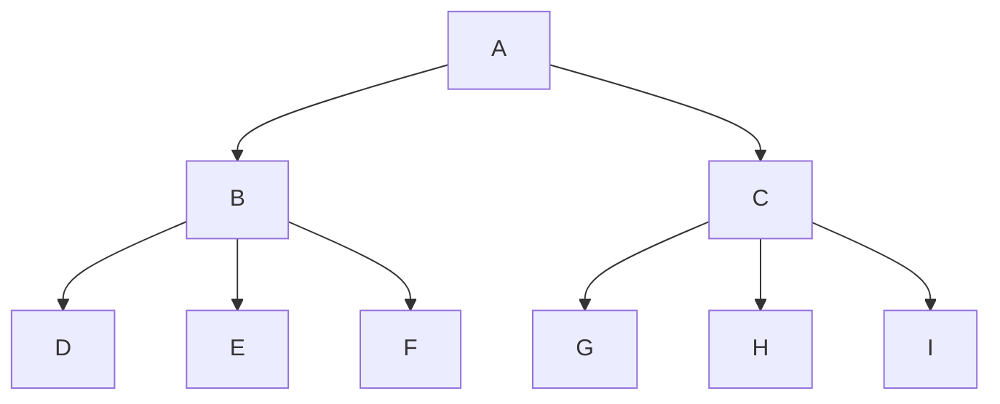
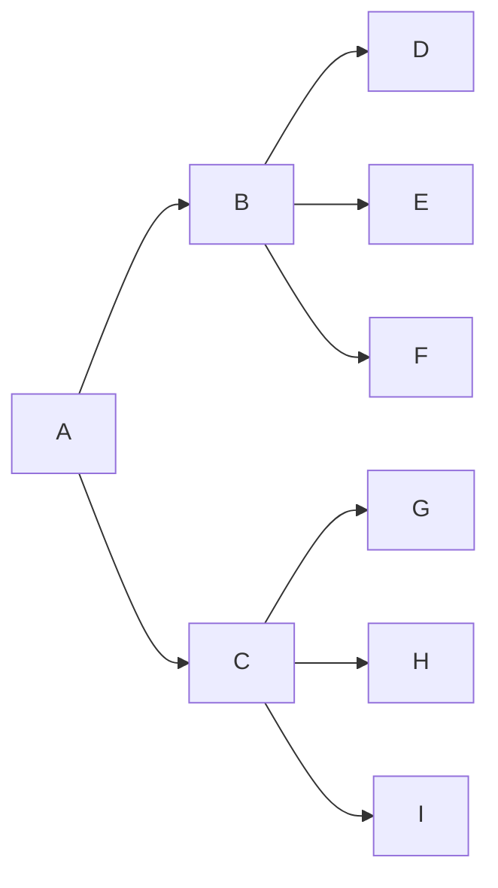

import Tabs from '@theme/Tabs';
import TabItem from '@theme/TabItem';

## Headings

# heading 1
```
# heading 1
```
## heading 2
```
## heading 2
```
### heading 3
```
## heading 3
```
#### heading 4
```
## heading 4
```
##### heading 5
```
## heading 5
```
###### heading 6
```
## heading 6
```

---


## Bold, Italic, Strikeout
**This is bold**
```markdown
**This is bold**
```

*This is italicized*
```markdown
*This is italicized*
```

~~this is strikedout~~
```markdown
~~this is strikedout~~
```

---


## Links and Images

this is a [link](https://notes.mcgarrigle.co).
```markdown
this is a [link](https://notes.mcgarrigle.co).
```


```markdown

```

---


## Lists, Block Quote, and Foot Note
1. I'm an ordered list
2. Second item
    1. Sub List
    2. I need to be indented twice
3. Aren't ordered Lists Cool?
```markdown
1. I'm an ordered list
2. Second item
    1. Sub List
    2. I need to be indented twice
3. Aren't ordered Lists Cool?
```

- I'm an unordered list
- Second item
  - Sub List
  - I need to be indented just once
- Aren't ordered Lists Cool?
```markdown
- I'm an unordered list
- Second item
  - Sub List
  - I need to be indented just once
- Aren't ordered Lists Cool?
```

>I'm a single-line block quote
```markdown
>I'm a single-line block quote
```

>I'm a multi-line block quote. It will automatically turn to multiple lines if the content is long enough. Lorem ipsum dolor sit amet, consectetur adipiscing elit, sed do eiusmod tempor incididunt ut labore et dolore magna aliqua. Ut enim ad minim veniam, quis nostrud exercitation ullamco laboris nisi ut aliquip ex ea commodo consequat.
```markdown
>I'm a multi-line block quote. It will automatically turn to multiple lines if the content is long enough. Lorem ipsum dolor sit amet, consectetur adipiscing elit, sed do eiusmod tempor incididunt ut labore et dolore magna aliqua. Ut enim ad minim veniam, quis nostrud exercitation ullamco laboris nisi ut aliquip ex ea commodo consequat.
```
Here's a sentence with a footnote. [^1]

[^1]: This is the footnote. You can add [links](https://docusaurus.io/) too! The return emoji brings you back to the linking text!

Here's another one. [^2]

[^2]: This is another footnote.
```markdown
Here's a sentence with a footnote. [^1]

[^1]: This is the footnote. You can add [links](https://docusaurus.io/) too! The return emoji brings you back to the linking text!

Here's another one. [^2]

[^2]: This is another footnote.
```

---


## Code 

:::tip[There are many more features to the code blocks!]

Docusaurus has built-in TONS of really cool code block features. Check them out [here](/docs/docusaurus/code-block-features).

:::

Here is some inline code `var = "hi I'm some code";` text can go after too.
```markdown
Here is some inline code `var = "hi I'm some code";` text can go after too.
```

```javascript
//This is a code block
//You can set the language to change the highlighting

const one = 1;
const two = 2;

return one + two; //returns 3
```

````markdown
```javascript
//This is a code block
//You can set the language to change the highlighting

const one = 1;
const two = 2;

return one + two; //returns 3
```
````
---


## Tables 


| Column 1 | Column 2 |
| ----------- | ----------- |
| I'm data | My name is Liam |
| What's up | Not much |
| Styling is pretty good | It is right? |
```markdown
| Column 1 | Column 2 |
| ----------- | ----------- |
| I'm data | My name is Liam |
| What's up | Not much |
| Styling is pretty good | It is right? |
```

|  | Column a  | Column b | Column c |
| ----------- | ----------- | ----------- | ----------- |
| 1 |  |  | |
| 2 |  |  | |
| 3 |  |  | |

```markdown
|  | Column a  | Column b | Column c |
| ----------- | ----------- | ----------- | ----------- |
| 1 |  |  | |
| 2 |  |  | |
| 3 |  |  | |
```

---


## Admonitions (Alerts) 


:::note

Some **content** in here

:::
```markdown
:::note

Some **content** in here

:::
```


:::tip[A cool tip is that you can add custom titles]

Some **content** in here

:::
```markdown
:::tip[A cool tip is that you can add custom titles]

Some **content** in here

:::
```

:::info

Some **content** in here

:::
```markdown
:::info

Some **content** in here

:::
```

:::warning

Some **content** in here

:::
```markdown
:::warning

Some **content** in here

:::
```

:::danger

Some **content** in here

:::
```markdown
:::danger

Some **content** in here

:::
```

---


## Dropdown (Details) 

:::warning[This requires MDX]

When creating your file, ensure it has the `.mdx` ending

:::

:::warning[This Can Be Buggy]

In my experience the details tags are buggy. Ensure is it formatted exactly as shown below including spaces and line breaks.

:::

<details>
  <summary>You can put a title here</summary>

    You can put any content you want in here!

</details>

```md
<details>
  <summary>You can put a title here</summary>

    You can put any content you want in here!

</details>

```

---

## Tabs

<Tabs>
  <TabItem value="apple" label="Apple" default>
    This is an apple 🍎
  </TabItem>
  <TabItem value="orange" label="Orange">
    This is an orange 🍊
  </TabItem>
  <TabItem value="banana" label="Banana">
    This is a banana 🍌
  </TabItem>
</Tabs>

````md
import Tabs from '@theme/Tabs';
import TabItem from '@theme/TabItem';
<!-- Ensure the inputs are under the front matter but over the rest of the content -->

<Tabs>
  <TabItem value="apple" label="Apple" default>
    This is an apple 🍎
  </TabItem>
  <TabItem value="orange" label="Orange">
    This is an orange 🍊
  </TabItem>
  <TabItem value="banana" label="Banana">
    This is a banana 🍌
  </TabItem>
</Tabs>
````

---


## Mermaid Charts

:::warning[This requires imports]

                <details>
                                        <summary>Import and Configuration Instructions</summary>

Install the plugin using the terminal
```
npm install --save @docusaurus/theme-mermaid
```

configure plugin in `docusaurus.config.ts` file
```js title="docusaurus.config.ts"
...
i18n: {
    defaultLocale: 'en',
    locales: ['en'],
  },

// highlight-start
  markdown: {
    mermaid: true,
  },
  themes: ['@docusaurus/theme-mermaid'],
// highlight-end

  presets:
...
```
The highlighted code above shows the configuration I used in the `docusaurus.config.ts` file. Docusaurus does this differently. It did not work for me, but you can find that [here](:::warning[This requires MDX]

When creating your file, ensure it has the `.mdx` ending

:::).

                </details>

:::


````

````
    

````    

````

---


## Get Any Look You Want

The amazing thing is that Docusaurus is completely open source, as are most of the sites that use Docusaurus!

This page right here is open source! If you click the "edit this page" button at the bottom of the page it will take you right to the source code! Most websites made with Docusaurus have this, including Docusaurus themselves. 

That means that if you see something you are trying to do on another Docusaurus build website, you can look at the code to see exactly how it was done.

There is a list of sites built with Docusaurus [here](https://docusaurus.io/showcase)!