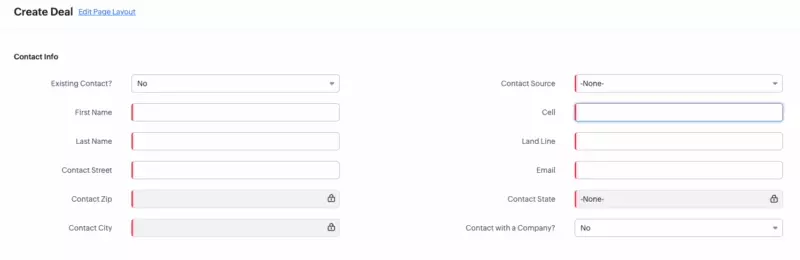

On this page, I will show how to search other records from client script and have the interface respond to the results. This is useful to search your contacts when creating a deal to ensure you aren't making duplicates, it can reduce a lot of manual work too. 

Here is an example of what this looks like in action



The client script code that makes that magic happen is below

```js title="phone-number-lookup.js" showLineNumbers
//line below allows us to access the cell phone field
const cellField = ZDK.Page.getField("cell_field_api_name");
//try catch is used because there will be an error on line 6 if the search doesn't return anything
try {
    //Line below searches contacts for contents of the phone number field
    const contactSearch = ZDK.Apps.CRM.Contacts.searchByPhone(cellField.getValue());
    //the if statement below runs the code if the search found a contact
    if (contactSearch[0].First_Name != null) {
        //line below shows the pop up message explaining the changes
        ZDK.Client.showMessage("A contact with that number is already in the system", "info");
        //all of the const lines allow us to access those fields in the code
        const existingContactToggle = ZDK.Page.getField("Existing_Contact_toggle_api_name")
        const contactNameField = ZDK.Page.getField("Contact_Name_api_name");
        const fName = ZDK.Page.getField("First_Name_api_name");
        const lName = ZDK.Page.getField("Last_Name_api_name");
        const source = ZDK.Page.getField("Source_api_name");
        const email = ZDK.Page.getField("Email_api_name");
        const zip = ZDK.Page.getField("Zip_api_name");
        const city = ZDK.Page.getField("City_api_name");
        const street = ZDK.Page.getField("Street_api_name");
        const state = ZDK.Page.getField("Contact_State_api_name");
        const cellPhone = ZDK.Page.getField("Cell_api_name");
        const landLinePhone = ZDK.Page.getField("Land_Line_api_name");
        const oldContactField = ZDK.Page.getField("Contact_Name_api_name");
        //line below toggles the checkmark on screen
        existingContactToggle.setValue("Yes");
        //Two lines below show the new fields that come on screen
        contactNameField.setVisibility(true);
        contactNameField.setMandatory(true);

        //set new contact create fields as optional
        //if this wasnt done they would be hidden but still required, causing issues
        fName.setMandatory(false);
        lName.setMandatory(false);
        source.setMandatory(false);
        email.setMandatory(false);
        zip.setMandatory(false);
        city.setMandatory(false);
        street.setMandatory(false);
        state.setMandatory(false);
        cellPhone.setMandatory(false);
        landLinePhone.setMandatory(false);

        //hide new contact create fields
        fName.setVisibility(false);
        lName.setVisibility(false);
        source.setVisibility(false);
        email.setVisibility(false);
        zip.setVisibility(false);
        city.setVisibility(false);
        street.setVisibility(false);
        state.setVisibility(false);
        cellPhone.setVisibility(false);
        landLinePhone.setVisibility(false);
        cellPhone.setValue("");

        //this defines the object lookup fields need
        oldContactInfo = { "id": contactSearch[0].id, "name": contactSearch[0].Full_Name };
        //this sets the lookup field to the above value
        oldContactField.setValue(oldContactInfo);
    }
}
catch (e) {}
```