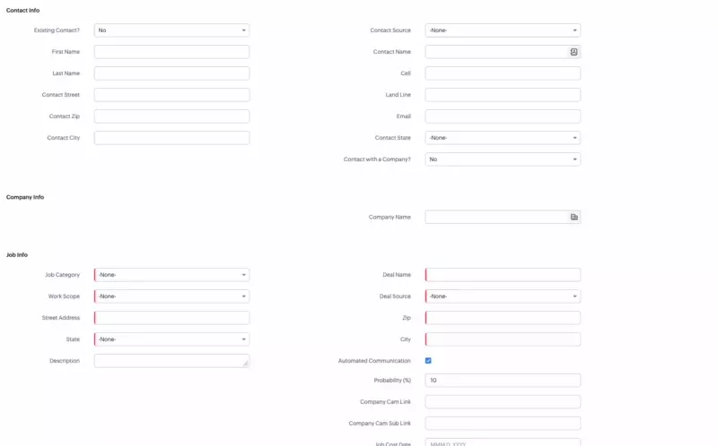

Client script is a Zoho feature that allows you to add JavaScript code to forms and input fields in the CRM.

It is a very useful feature for data validation and business logic rules.

While it is very useful, it has some bugginess to it. Unfortunately, the client script runs AFTER the page loads, so you can see the form changing in front of you. See the video below for an example.

Even with this unfortunate jank, it is still much better than nothing! 
I for one heavily use client script, I do not use any inputs in the crm without it!